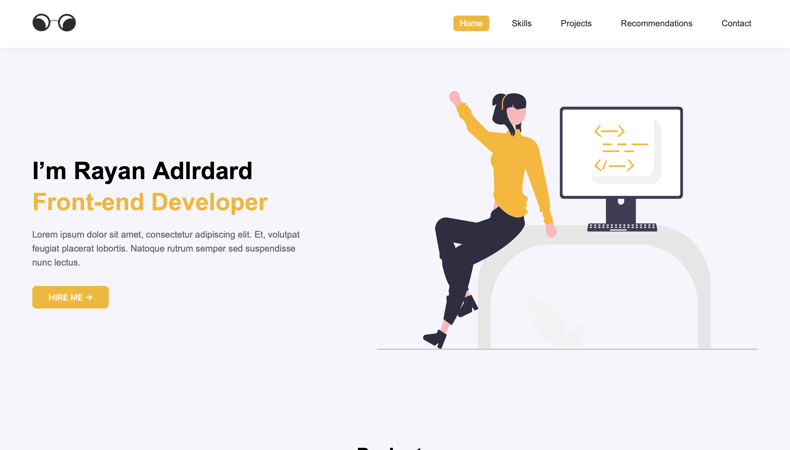
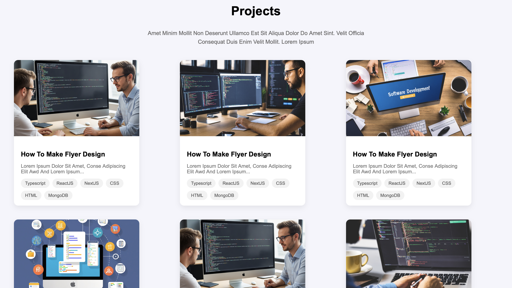
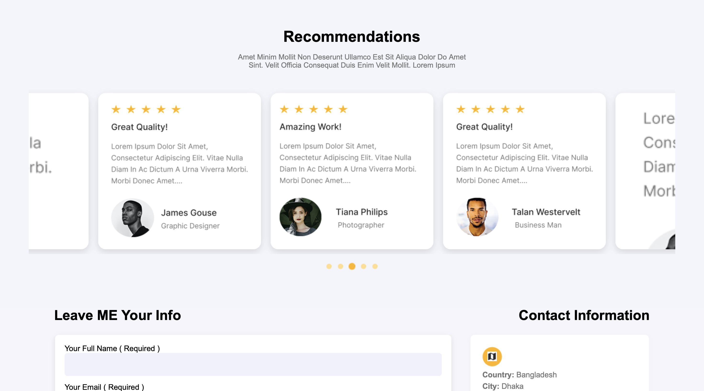
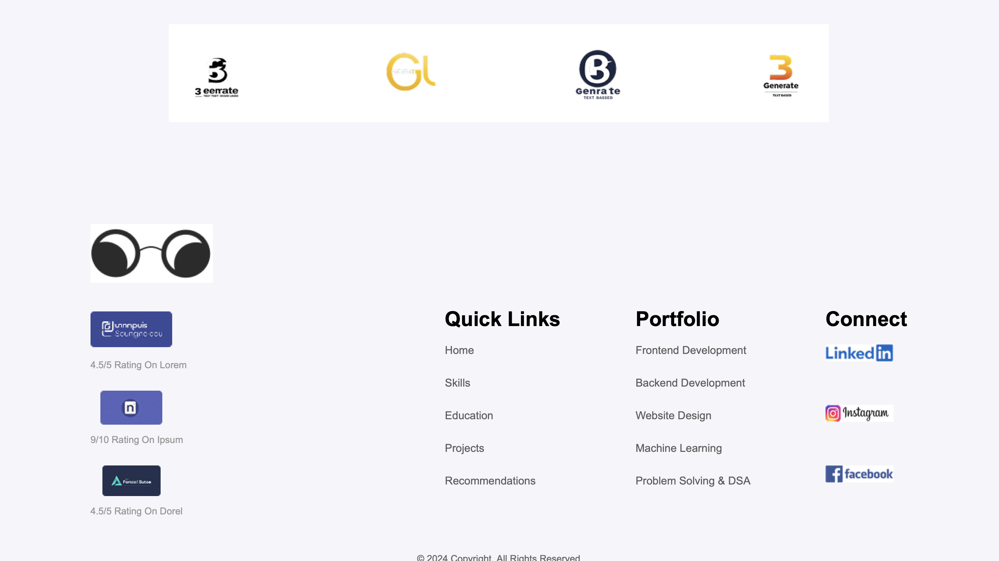

# Personal Portfolio Website

A fully responsive personal portfolio website built using **HTML**, **CSS**, and **JavaScript**, based on a custom Figma design. The website showcases my profile, projects, contact form, and testimonials with a clean UI, smooth animations, and optimized styling for readability across all devices.

---

## Features
- **Responsive Design** – Works seamlessly on desktops, tablets, and mobile devices.  
- **Modern UI** – Designed using Figma and implemented with pixel-perfect accuracy.  
- **Portfolio Showcase** – Displays my profile and 6+ projects with clear, accessible layouts.  
- **Contact Form** – Functional form for visitors to get in touch.  
- **Interactive Elements** – Smooth animations and hover effects for an engaging experience.  
- **Cross-Browser Compatibility** – Tested on major browsers for consistent performance.

---

## Tech Stack
- **HTML5** – Semantic and accessible markup  
- **CSS3** – Flexbox, Grid, animations, and responsive design techniques  
- **JavaScript (ES6)** – DOM manipulation and interactive components  
- **Figma** – UI/UX design reference  
- **VS Code** – Development environment

---

## Project Structure
```
├── index.html        # Main HTML file
├── /assets           # Images, icons, and media
├── /css              # Stylesheets
├── /js               # JavaScript files
└── README.md         # Project documentation
```

---

## Screenshots
 
 
 
 

---

## Setup & Installation
1. Clone this repository:  
   ```bash
   git clone https://github.com/yourusername/portfolio-website.git
   ```
2. Open the project folder:  
   ```bash
   cd portfolio-website
   ```
3. Open `index.html` in your browser **or** run with a Live Server extension in VS Code.

---

## Contact
Feel free to connect with me for collaboration or feedback:  
**Email:** akshat.singh1895@gmail.com  
**LinkedIn:** (https://www.linkedin.com/in/akshat-singh-39836920a?utm_source=share&utm_campaign=share_via&utm_content=profile&utm_medium=ios_app)  
